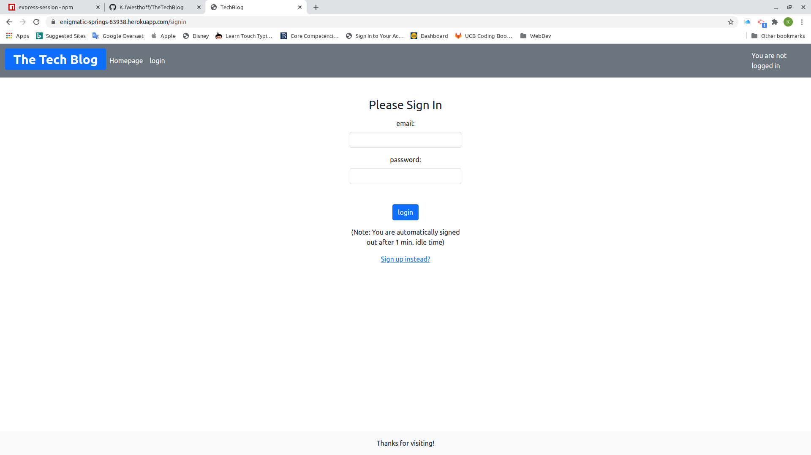

  # Project Title: The Tech Blog 
  ### 
  
  ## Table of contents:
  1. [Title](#Project-Title)
  1. [License](#License)
  1. [Project Description](#Project-Description)
  1. [Installation](#Installation-Instructions)
  1. [Useage](#How-To-Use)
  1. [How to Contribute](#How-to-Contribute)
  1. [Test Instructions](#Test-Instructions)
  1. [Questions](#Questions)

  ## License: 
  ### This project is licensed under MIT (click on icon near the top):
  or here: [MIT](https://opensource.org/licenses/MIT)
 

  ## Project Description:
  Blog app with CRUD and user sign-in
  ## Installation Instructions:
  Fork it on github and deploy on a place with a sqlserver, evironment variables DB_NAME='techblog_db'
  , DB_USER = "your username", DB_PW_"your password"  SESSION_SECRET = "your cookie code" 
  ## How To Use
  The app can be found here:
  
  [https://enigmatic-springs-63938.herokuapp.com](https://enigmatic-springs-63938.herokuapp.com/)
  
  * First you are routed to the "Homepage" where you can view posts.
  * To edit or comment on a post you need to be logged in.
  * You log in or register using "login". If you do not have a loging you can sign up.
    * Note you are logged out after 1 min. inactiveness..    
  * General usage:
    * See posts on 'Homepage'
    * Create and edit posts on 'Dasboard' page. 
    * To comment on posts you need to be logged in.

  * It works fine from a phone.

  Here is a picture:
  

  ## How to Contribute:
  * Bug finds and fixes are very welcome
  * Checkout the github repo and please raise any issues with The Tech Blog you come across 
  * Even better - help with bugfixes and features by submitting your solutions in pull requrets for the repo
  * Follow the code of coduct for contribution outlined in [Contributor Covenant](https://www.contributor-covenant.org/) 
  ## Test Instructions
  ### The testing strategy is as follows
  #### Trial and error for now

  ## Questions
  Feel free to reach out either in the projects GitHub page or send an email to the address below
  ### Github page:
  [https://github.com/KJWesthoff/TheTechBlog](https://github.com/KJWesthoff/TheTechBlog)
  ### email:
  [karl.johan.westhoff@gmail.com](mailto:karl.johan.westhoff@gmail.com) 
